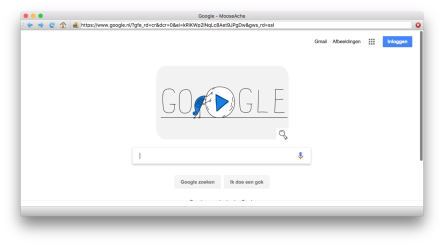

This is an example web browser built with Python and Qt. Using the 
QtWebEngineWidgets system introduced in Qt5.6, this provides a single-window
browsing experience with the usual controls, as well as saving and loading HTML.

Thanks

Created By Amitesh kumar mishra...