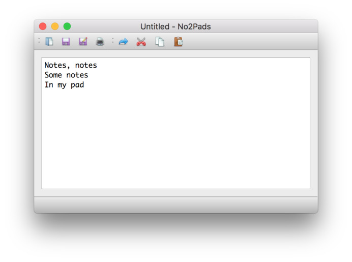

#  A Notepad clone in PyQt

A very simple notepad clone using the QTextEdit widget to handle more or less
everything. Supports file loading, saving and printing.

Thanks

Created By Amitesh kumar mishra...