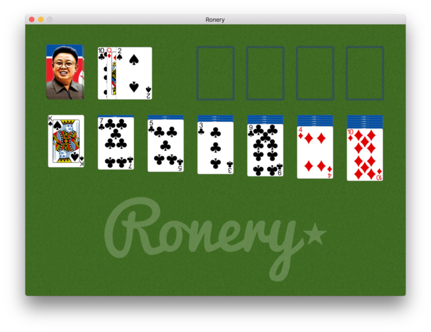
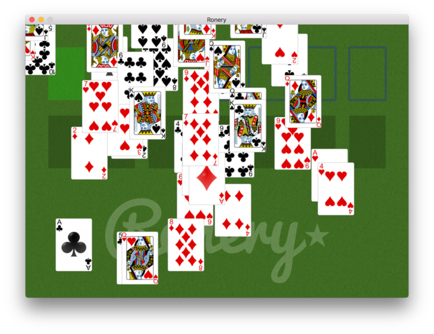

# Ronery — A Solitaire game in PyQt

The classic card Solitaire (Klondike) game with a North Korean / 
'Team America: World Police' twist. The game is otherwise identical, 
 offering the same options. Built with PyQt, it uses QGraphicsScene
 to handle the play area.

The classic Solitaire win-screen is also implemented, although since
the play canvas is not a bitmap it doesn't "fill up". It's still
sufficiently satisfying. 

The configuration options allow for 3-draw and 1 draw styles, with 3, 5
or infinite rounds.

## Code notes

### Card handling

The approach I used here was to treat each place where cards can be placed
as a 'stack' object, which handles the cards it currently holds. Each stack
is responsible for the layout of the cards on it's pile.

A stack is also responsibly for accepting/rejecting an attempted drop of a
card on it. Some stacks, e.g. the deck + deal pile do not accept any drop.
Others, such as the finish piles, have specific rules.

In most cases there is no relationship between any cards on a stack, with
the exception of the 'in play' stacks along the bottom. Here cards have
a parent-child relationship, allowing multiple cards to be dragged at once.

### The end animation

The end-game was a bit weird to implement. Since it is self-contained
and happens 'outside' of game time the first thought was to have a 
separate fake event loop, hitting `QApplication.processEvents` to 
tick over. But that's nasty.

Instead the animation is handled by a QTimer, normally idle during play, 
which once triggered repeatedly pings an 
animation step-forward slot. This moves cards (faking 'gravity', bouncing)
as well as re-stacking them once they're out of the play area. 
Restacking uses the normal stacking code so they can pile up.
The final piece of the puzzle was to block user interaction, otherwise 
the cards could still be grabbed and dropped they bounced.
The easiest way to  achieve this is to place an object over the entire
window which is set to capture (and discard) all mouse clicks.

Thanks

Created By Amitesh kumar mishra...