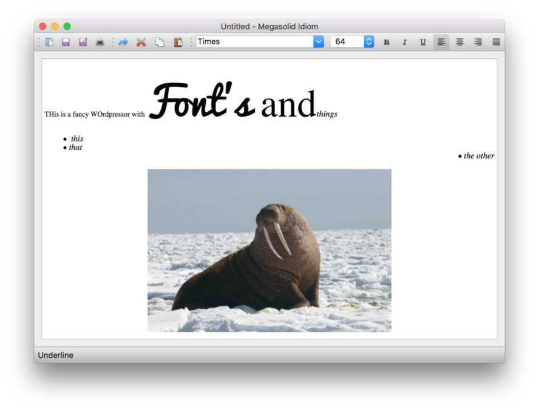

#  A rich text editor in PyQt

The word processor for all your small, poorly formatted documents. 
An extension of the notepad, again using a QTextEdit but with rich
text editing enabled. 
 
The editor supports multiple fonts, styles and paragraph text alignment.
There is also support for drag-drop of images, which are automatically
opened and embedded.

Saves and opens HTML format documents.
 

Thanks

Created By Amitesh kumar mishra...